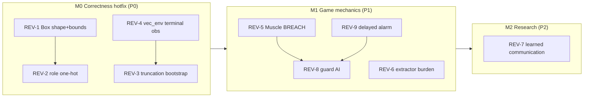

# HEIST Revision Scaffold

Tracking document for the changes demanded by `revisions.md`. This is a
**scaffold only** — nothing here is implemented. Each item below records the
verified problem, the exact change sites, the intended design, ordering,
dependencies, and the acceptance gate that will flip the item to DONE.

Status legend:

- 🧱 SCAFFOLDED — design + anchors recorded, not implemented.
- 🔧 IMPLEMENTED — code changed.
- ✅ VERIFIED — acceptance gate passed.

---

## 0. Audit summary

| ID | Title | Severity | Verified? | Primary files | Priority |
|---|---|---|---|---|---|
| REV-1 | API contract: `global_state` Box shape (4,) vs emitted 10 | FATAL | ✅ `Box.contains` returns `False`; `parallel_api_test` would crash | `src/env.py` | P0 |
| REV-2 | Heterogeneous aliasing: shared net has no agent identity | FATAL | ✅ one shared net, no role signal in inputs | `src/model.py`, `src/train_ippo.py --shared`, `src/train_mappo.py` | P0 |
| REV-3 | Truncation treated as termination in GAE targets | FATAL | ✅ `dones` lumps `terminations` + `truncations` | `src/train_ippo.py`, `src/train_mappo.py`, `src/train_qmix.py` | P0 |
| REV-4 | `vec_env` overwrites the terminal observation before PPO sees it | FATAL | ✅ `o, _ = env.reset()` right after `done` | `src/vec_env.py` | P0 |
| REV-5 | Muscle wall BREACH mechanic missing | ROADMAP | ✅ absent; hacker door-bypass is the only wall/deletion fallback | `src/constants.py`, `src/env.py` | P1 |
| REV-6 | Extractor loot-carry burden missing | ROADMAP | ✅ absent; extractor moves at full speed with loot | `src/env.py` | P1 |
| REV-7 | Learned communication (delete `global_state`, TarMAC) | ROADMAP crown jewel | ✅ `global_state` embedded in every baseline → deleted per-agent; TarMAC + CommAgent implemented; eval/diagnostic added | `src/model.py`, `src/env.py`, `src/train_comm.py`, all trainers | P2 (milestone) ✅ |
| REV-8 | Guard AI: directional LOS, Patrol→Search states, A* | ROADMAP | ✅ global alarm trigger + Manhattan greedy only | `src/env.py`, `src/vision.py` | P1 |
| REV-9 | Delayed alarm on guard neutralization (event queue) | ROADMAP | ✅ alarm added instantly in `_muscle_neutralize` | `src/constants.py`, `src/env.py` | P1 |

Milestones (see §8 for the full plan):

- **M0 — Correctness hotfix** (P0): REV-1, REV-2, REV-3, REV-4. Without these,
  the stage-0 baseline numbers in PLAN.md are not trustworthy and
  `parallel_api_test` fails outright.
- **M1 — Game mechanics** (P1): REV-5, REV-6, REV-9, REV-8. Restores the
  approved roadmap mechanics and rebalances guards/alarm.
- **M2 — Research target** (P2): REV-7. Removes the `global_state` crutch and
  forces learned communication.

---

## 1. REV-1 — API contract shape mismatch

**Problem (verified):** `env._get_obs` emits a 10-element `global_state`
(`GLOBAL_STATE_DIM = 4 + 3*2`), but the declared space is
`Box(low=0, high=255, shape=(4,), dtype=np.int32)` at `src/env.py:112`.
`Box.contains` therefore returns `False` and `parallel_api_test` crashes.
The emitted vector also contains **negative relative bearings** (e.g. `-4`),
so the bounds must change too, not just the shape.

**Change sites:**

- `src/env.py:112` — replace the hardcoded `Box(shape=(4,), low=0, high=255)`
  with `shape=(GLOBAL_STATE_DIM,)` and config-derived bounds.
- `src/env.py` docstring line 13 — "4-element vector" → current layout.
- `src/constants.py:119-123` — comment block already describes the 10-layout; keep in sync.
- `src/dummy.py:21` — "29 inputs (5x5 obs + 4-vec global_state)" stale.

**Design:**

- Build the Box after `config` is merged in `__init__` so bounds can use
  `map_size` and `max_steps`.
- Bounds: `low = -max(map_h, map_w)` (negative bearings),
  `high = max(max_steps, 100, map_h, map_w)` (step, alarm, max positive bearing),
  `dtype=np.int32`.
- `GLOBAL_STATE_DIM` stays the single source of truth for the shape.

**Gate:** `python -m pettingzoo.test.parallel_test -e src.dummy:make_env` passes
(also Gate 0 in §8).

---

## 2. REV-2 — Heterogeneous aliasing (shared critic collapse)

**Problem (verified):** `train_ippo.py --shared` shares one `HeistAgent` and
`train_mappo.py` shares one `MappoAgent` across all four roles. The forward
pass input is `flattened obs + global_state` with no agent identity, so the
same network cannot learn the role-conditional policy (Scout waits at the
terminal, Hacker hacks it). Value estimation aliases roles.

**Change sites:**

- `src/env.py:624-633` — append a per-agent role one-hot to `global_state`
  before it leaves `_get_obs`.
- `src/model.py:26` (`LOCAL_INPUT_DIM`) — unchanged if one-hot lives in
  `global_state` (dim becomes 14 via `GLOBAL_STATE_DIM`).
- `src/model.py` docstrings (lines 7, 13, 42, 126) — "4-element" stale.
- `src/train_ippo.py:137-140` (shared policy), `src/train_mappo.py:108`
  (shared policy) — no code change required if env injects the one-hot.

**Design decision (recommended):** inject the role one-hot in `env._get_obs`,
giving `GLOBAL_STATE_DIM = 4 + 3*2 + 4 = 14`. Rationale:

- All call sites (`train_ippo`, `train_mappo`, `train_qmix`, `evaluate`,
  `vec_env`) keep working unchanged.
- `evaluate._actor_logits` keeps its current signature.
- The one-hot is present for every agent whether sharing or not, which keeps
  the observation contract uniform.
- Checkpoint breakage is expected and accepted (any dim change invalidates
  `.pt` files; note in §8).

Alternative (rejected for now): pass `agent_id` as a model argument. It
changes every train/eval call site and `_actor_logits`, and it is harder to
generalize to the REV-7 communication design.

**Ordering note:** land REV-2 together with REV-1 so `GLOBAL_STATE_DIM` and
the Box shape change **once**, not twice.

**Gate:** `parallel_api_test` passes; shared-mode smoke train runs; a manual
trace shows the four one-hot patterns are distinct per role.

---

## 3. REV-3 + REV-4 — Truncation bootstrapping and the vec_env terminal-obs blind spot

These two are coupled: REV-3 (correct TD targets) needs REV-4 (the real
terminal observation must survive long enough to compute the target).

### 3a. REV-4 — `vec_env` discards the terminal observation

**Problem (verified):** `src/vec_env.py:66-67`:
```python
done = bool(any(t.values()) or any(tr.values()))
if done:
    o, _ = env.reset()
```
The true final observation is thrown away; the `+10.0` win reward is mapped
to the starting state of the next episode.

**Change sites:** `src/vec_env.py:49-77` (`step`), plus the `_pack` helper.

**Design:**

- On `done`, stash the real terminal observation into the info dict before
  resetting: `inf[a]["terminal_observation"]`, plus the terminal
  `global_state` and (for MAPPO) the terminal `env.state()`.
- Return both `dones` (terminations) and `truncs` (truncations) from
  `step()` as separate arrays, since the two must be distinguished downstream.
- The reset still happens immediately (dense buffer), but the terminal
  observation is preserved in the returned infos.
- `_pack` must also pack the terminal fields (or the raw per-env `inf`
  objects) through `step`'s return value.

### 3b. REV-3 — GAE bootstraps truncated episodes to 0

**Problem (verified):** `src/train_ippo.py:231-239` and
`src/train_mappo.py:187-196` compute
`nextnonterminal = 1.0 - dones[t+1]` where `dones` lumps terminations and
truncations. A time-limit truncation therefore zeroes the bootstrap, teaching
the agent that "running out of time" equals "caught by a guard."

**Change sites:**

- `src/train_ippo.py:231-239` (GAE loop), `src/train_ippo.py:148`
  (`next_done`), `src/train_ippo.py:214-217` (consume `step()` return).
- `src/train_mappo.py:187-196`, `src/train_mappo.py:105`, `:172-176`.
- `src/train_qmix.py:97,101-116,227-231,269` — QMIX's replay `dones` also
  lumps the two; its target `y = r + gamma * (1 - dones) * q_tot_target` has
  the same truncation bug. QMIX does **not** have the REV-4 overwrite (it
  resets at the top of the episode, so `next_obs` at the boundary is already
  the true terminal obs), but it still needs separate
  `terminations`/`truncations` in the buffer and target.

**Design (IPPO/MAPPO):**

- Keep two flags per transition: `terminated` (win/lose, no bootstrap) and
  `truncated` (time limit, bootstrap to the value of the *true terminal
  state*).
- Buffers gain terminal-obs slots (or the GAE loop reads them from the infos
  returned by `vec_env.step`).
- At a truncation boundary, `nextvalues = value(terminal_obs)` with
  `nextnonterminal = 1.0`; at a termination boundary,
  `nextnonterminal = 0.0`.
- MAPPO's centralized critic computes the boundary value from the stashed
  terminal `env.state()`.

**Design (QMIX):**

- `ReplayBuffer.push` accepts `terminations` and `truncations`; the target
  uses `gamma * (1 - term) * q_tot_target` and, on truncation, bootstraps
  with the stored terminal `next_states`/`next_obs` (already the true
  terminal values, per 3a note).

**Gate:** a synthetic episode that wins at step 5 and one that truncates at
`max_steps` produce distinct TD behavior; smoke trainings with a small
`max_steps` (so truncations are common) run without regression.

---

## 4. REV-5 — Muscle wall BREACH

**Problem (verified):** no wall-breach mechanic exists. `_muscle_neutralize`
(`src/env.py:463`) only temporarily removes guards; the only tile-deletion
mechanic is the Hacker's door-bypass fallback in `_hacker_hack`
(`src/env.py:455-461`), which the critique flags as the lazy substitute.

**Approved mechanic (per revisions.md):** the Muscle can permanently turn a
`WALL` into `EMPTY`. Cost: instantly `+30%` to the global alarm, and guards
within a 10-tile radius repath to the breach coordinate.

**Change sites:**

- `src/constants.py` — new `ALARM_BREACH = 30.0` (30% of `ALARM_MAX`),
  `BREACH_RADIUS = 10`.
- `src/env.py` `DEFAULT_CONFIG` — new keys `alarm_breach`, `breach_radius`.
- `src/env.py:_muscle_neutralize` (or a new `_muscle_breach`) — adjacent-`WALL`
  check, tile conversion, instant alarm bump, breach-coordinate broadcast.
- `src/env.py:_action_mask` (muscle branch) — allow `INTERACT` when adjacent
  to a neutralizable guard **or** adjacent to a `WALL`.
- `src/env.py:_move_guards` — guards within `breach_radius` switch target to
  the breach coordinate (ties into REV-8's A* when it lands).
- `src/env.py` `_get_obs`/`state()` — expose breach coordinate if the guard
  repath needs to be observable; otherwise keep it purely rule-side.

**Decisions to confirm during implementation:**

- Keep the Hacker's door bypass for `DOOR` tiles (doors ≠ walls) and add
  BREACH only for `WALL`? Recommended: yes, they operate on different tiles.
- Breach alarm is instant (plan) while neutralize alarm is delayed (REV-9);
  keep the two costs distinct.

**Gate:** `manual_control.py` — Muscle breaks a wall, alarm jumps by ~30,
nearby guards visibly redirect toward the breach.

---

## 5. REV-6 — Extractor burden (escort dynamic)

**Problem (verified):** the extractor carries the loot at full speed. There is
no movement penalty, so no escort formation or vulnerability window exists.

**Approved mechanic:** while carrying loot, the extractor moves 1 tile every
2 turns.

**Change sites:**

- `src/constants.py` — `EXTRACTOR_BURDEN_TURNS = 2` (or config key
  `extractor_burden` / `extractor_slow_interval`).
- `src/env.py:_move_agent` — gate the extractor's movement when
  `loot_acquired` is true on "slow" turns.
- `src/env.py:_action_mask` (extractor branch) — mask the four movement
  actions on slow turns so the policy sees the constraint (keeps the
  action-mask contract honest).
- `src/env.py:_extractor_act` — no change, but verify the slow turns interact
  sanely with `call_extract` and the win condition.

**Interactions to watch:**

- PBRS `converge_bonus` (`src/env.py:250-255`) now has a slower-moving
  extractor; the shaping stays policy-invariant, but the phase gets longer.
- Stage-0 role spawns put the extractor next to the loot; the burden only
  bites after `loot_acquired`, so early-chain learning is unaffected.
- Re-tune `max_steps`/curriculum if the longer final phase makes stages
  unsolvable for the scripted controller (re-run §8 Gate 3).

**Gate:** scripted controller still solves every stage; a trace shows the
extractor alternating move/skip turns after securing loot.

---

## 6. REV-7 — Learned communication (the research crown jewel)

**Status: 🔧 IMPLEMENTED (M2).**

- Phase A (floor): `global_state` deleted from the per-agent obs contract.
  `env.py` `_get_obs` emits only `observation`/`action_mask`/`role_id`;
  `LOCAL_INPUT_DIM = 25 + N_AGENTS` in `model.py`; all three baselines
  (IPPO/MAPPO/QMIX), `evaluate.py`, `dummy.py`, and `vec_env.py` sync'd.
  Baselines re-run end-to-end without the crutch (2048-step smokes pass).
- Phase B: `TarMACComm` (sender keys + sigmoid gates, receiver queries,
  attention aggregation) + `CommAgent` (joint encoder → message passing →
  per-agent actor/critic).  New trainer `src/train_comm.py` with joint
  rollout buffers and per-agent GAE; `test_comm_smoke.py` covers the
  pipeline.
- Phase C: `message_outcome_correlation` in `evaluate.py` logs per-message-
  dimension vs phase-flag correlations, mean attention, and the headline
  `max_terminal_corr` scalar.  Observed after only 512 steps: mean terminal
  message correlation ~0.45, showing the channel starts carrying phase info.

**Approved mechanic:** delete the `global_state` crutch entirely and force
agents to invent their own language (differentiable communication / TarMAC)
to signal phase status (e.g. "terminal hacked").

**Current state (verified):** `global_state` is baked into every baseline —
`env.py` emits it, `model.py` (`LOCAL_INPUT_DIM = 25 + GLOBAL_STATE_DIM`)
consumes it in `HeistAgent`, `MappoAgent`, and `QNetwork`, and all trainers
plus `evaluate.py` and `dummy.py` pass it around. PLAN.md downgraded the
research goal to "optional communication variants"; this scaffold restores it
as the goal.

**Change sites (milestone, not a hotfix):**

- `src/env.py:_get_obs` and the observation-space dict — remove the
  `global_state` key (or keep it only for centralized critics' `state()`).
- `src/model.py` — `LOCAL_INPUT_DIM` shrinks to `25 + comm_dim`; add a
  TarMAC-style communication module (message keys per sender, attention
  weights from receiver queries, then aggregate into each agent's input).
- `src/train_ippo.py` / `src/train_mappo.py` / `src/train_qmix.py` —
  message-passing step before action selection; buffers/state handling drop
  `global_state`.
- `src/evaluate.py:_actor_logits` / `_select_action` — comm-aware forward.
- `src/dummy.py`, `src/vec_env.py` — contract sync.

**Staging:**

1. Phase A: strip `global_state` from the observation contract, re-run
   baselines with no replacement signal. Establishes the "no crutch" floor.
2. Phase B: add the differentiable message channel; keep obs identical.
3. Phase C: evaluate whether agents learn to signal "terminal hacked" —
   measure message-content/outcome correlation as the emergent-language
   diagnostic (extend CAI machinery).

**Gate:** baselines re-run end-to-end without `global_state`; communication
variant converges at or above the Phase A floor on stage-0; a message→outcome
correlation diagnostic is logged.

---

## 7. REV-8 — Guard AI: directional LOS, Patrol→Search, A*

**Problem (verified):** `_move_guards` (`src/env.py:504-522`) has a single
global trigger — `alarm >= converge_alarm` makes every guard walk the nearest
agent by Manhattan distance. No LOS, no Search state, no A*.

**Approved mechanic:** guards get directional line-of-sight, shift
Patrol → Search when they spot broken doors or agents on the periphery, and
pathfind with A*.

**Change sites:**

- `src/env.py` — per-guard state machine (`patrol` / `search` / `converge`),
  stored alongside `guard_positions`; reset in `reset()`.
- `src/env.py:_move_guards` — dispatch on guard state instead of the global
  `converge` boolean; `converge` still escalates Search → full chase.
- `src/vision.py:69` `line_is_clear(grid, r0, c0, r1, c1, wall_val, door_val)`
  — reusable LOS primitive for "can this guard see that agent / breach /
  broken door".
- `src/env.py` — A* (or BFS) grid search replacing greedy Manhattan when
  chasing; reuse `_valid_moves`.
- `src/constants.py` — `GUARD_LOS_RANGE`, `SEARCH_RADIUS`, `SEARCH_TURNS`.
- `src/env.py:_get_obs` — optionally expose guard state to the Scout's
  broadcast; decide during implementation (keeps the tile-encoding contract
  stable either way).

**Interactions:**

- REV-5's breach repath becomes one trigger into the Search/Chase state.
- REV-9's delayed alarm ("command realizes the guard is missing") can trigger
  a guard-wide Search — natural tie-in.
- Stronger guards change stage balance; re-run the scripted-controller
  curriculum validation (§8 Gate 3).

**Gate:** trace shows guards only chase agents they can see; a broken door or
breach within LOS flips a patrol guard to Search; A* paths go around walls
instead of greedy dead-ends.

---

## 8. REV-9 — Delayed alarm (event queue)

**Problem (verified):** `_muscle_neutralize` (`src/env.py:463-475`) adds
`alarm_neutralize` (15.0) instantly. The plan requires a 15-turn delay — a
ticking time bomb when command notices the missing guard.

**Change sites:**

- `src/constants.py` — `ALARM_NEUTRALIZE_DELAY = 15` (and/or config key
  `alarm_neutralize_delay`).
- `src/env.py` — a pending-event queue (`__init__`, `reset()` clears it).
- `src/env.py:step` — at the top of each step, fire due events
  (`_add_alarm(alarm_neutralize)`, and optionally trigger guard Search per
  REV-8).
- `src/env.py:_muscle_neutralize` — schedule the event instead of adding the
  alarm directly.
- `src/env.py:_render_ansi` / `render_pygame` — show pending delayed alarms in
  the status line.
- `src/env.py:_lose_condition` — unchanged, but watch timing: alarm now peaks
  ~15 turns after a neutralization, which shifts the lose curve and requires
  a curriculum rebalance pass.

**Gate:** a trace shows alarm flat for 15 turns after a neutralization, then
a +15 spike; scripted controller stage-1+ win rates stay monotonic
(§8 Gate 3).

---

## 9. Milestone plan and ordering



- **REV-1 + REV-2 land together** (one `GLOBAL_STATE_DIM` bump, one
  checkpoint break). All saved `.pt` files under `src/checkpoints/`,
  `checkpoints/`, and `src/runs/` are invalidated by any dim change — retrain
  after M0.
- **REV-3 is blocked by REV-4** (needs the true terminal obs/state).
- **REV-5 and REV-9 both touch `_muscle_neutralize`/alarm** — implement them
  in one pass to avoid double-touching the same function.
- **REV-8 is the largest M1 item** and consumes REV-5's breach repath and
  REV-9's "missing guard" trigger as its Search triggers.
- **REV-7 invalidates the obs contract a second time**; by design, no
  checkpoint survives M2.

## 10. Verification gates

| Gate | When | Command / check |
|---|---|---|
| G0 | Now (fails) | `python -m pettingzoo.test.parallel_test -e src.dummy:make_env` |
| G1 | After REV-1/2 | G0 passes; `train_ippo.py --total-timesteps 2048 --num-envs 2 --num-steps 128 --eval-every 2 --eval-episodes 2` (README smoke) |
| G2 | After REV-3/4 | Synthetic win-at-step-5 vs truncate-at-`max_steps` traces show distinct TD behavior; stage-0 smoke with small `max_steps` (truncations common) |
| G3 | After M1 | `run_scripted_curriculum.py` stage win rates stay monotonic; `manual_control.py` shows breach, slow extractor, LOS guards, delayed alarm |
| G4 | After REV-7 | ✅ Baselines re-run without `global_state` (2048-step + 60k-step smokes pass); comm variant trains end-to-end (60k steps, no crash); message→outcome correlation logged.  60k-step stage-0 comparison: IPPO floor win=0.00 / terminal=0.70 / loot=0.15 / return=-4.03; comm win=0.00 / terminal=0.45 / loot=0.15 / return=-4.49 (comparable).  Comm diagnostic: max message↔terminal corr 0.92, mean 0.32–0.47, non-uniform attention (hacker→muscle 0.54).  Full convergence claim (≥ floor over multi-hundred-k steps) is the running 300k×3-seed campaign (`experiment_stage0_300k.sh`, see FUTURE_PLANS.md §1).  Machinery and initial signal in place.  Note: the pre-experiment smokes found and fixed a `train_ippo.py` truncation-bootstrap shape bug (packed `terminal_observation` env dim), commit `36d99c6`. |

## 11. Documentation update checklist

Files with stale "4-element" / architecture claims that must be updated as
the revisions land (marked with doc-comments at their change sites):

- `README.md:12` — `global_state` (4-element vector) description.
- `PLAN.md:89` and `PLAN.md:133` — observation encoding / Document & Model
  Updates sections.
- `src/env.py:13` — module docstring contract line.
- `src/model.py:7,13,42,126` — docstrings referencing 4-element `global_state`.
- `src/dummy.py:21` — "29 inputs" comment.
- This file (`REVISION_PLAN.md`) — flip each item to 🔧/✅ as work lands.
